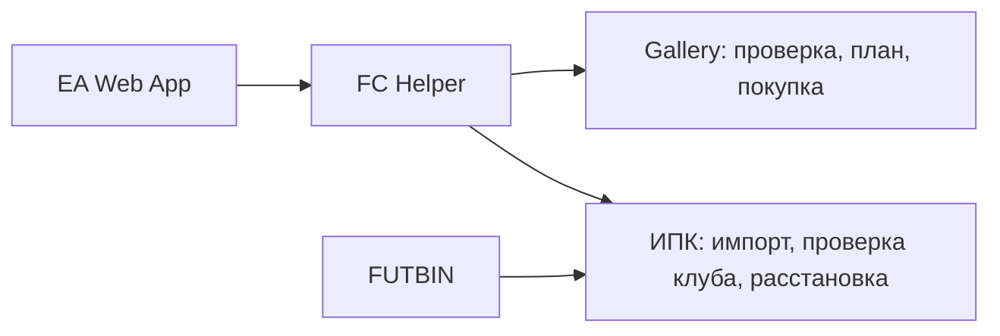

# FC Gallery + ИПК Assistant

Локальное расширение Chrome для **EA SPORTS FC 27 Ultimate Team Web App**. Оно помогает рассчитать закрытие Gallery, показывает карты и цены до покупки, импортирует готовые решения ИПК с FUTBIN и расставляет купленный состав на открытом поле EA.

> Версия: **1.3.8** · Manifest V3 · интерфейс на русском языке



## Возможности

### Gallery

- Загружает категории, наборы, грейды и нужное количество очков Gallery.
- Проверяет историю аккаунта и определяет уже засчитанные карты.
- Показывает список карт, которые планируется купить, до запуска покупки.
- Для каждой карты показывает ориентировочную цену и заданный пользователем максимальный BIN.
- Подбирает самый дешёвый достижимый план под заданный грейд и общий бюджет.
- Для каждого грейда `D / C / B / A / S` использует его собственный порог очков и заново оптимизирует состав из полного пула выбранного набора.
- Показывает, сколько мест нужно закрыть, сколько карт уже засчитано, сколько доступно в текущем лимите и сколько конкретно не хватает.
- Если лимит мал, указывает точный рекомендуемый потолок и бюджет, перечисляет карты выше лимита и карты без доступного лота.
- Если карты нет на рынке, она исключается из текущего запуска, а план автоматически пересчитывается с другой картой без снижения выбранного грейда.
- Перед каждой покупкой повторно проверяет живой рынок EA и выбирает самый дешёвый найденный лот.
- По умолчанию работает в полуавтоматическом режиме: показывает найденную карту и точную цену, затем ждёт отдельного ответа «Да» или «Нет».
- Если EA отклоняет выбранный лот с кодом `461`, полуавтомат исключает его, предлагает другой лот той же карты и после трёх неудач продолжает со следующей картой.
- Автоматический режим доступен отдельным выбором и сопровождается предупреждением о нарушении правил EA и риске санкций.
- После покупки может оставить карту в клубе, переместить в трансфер-лист или выставить ниже текущего рынка.
- Если EA отклоняет выставление с кодом `461`, выполняет быструю продажу купленной карты.
- Поддерживает остановку после текущего запроса и не повторяет покупку при неоднозначном ответе EA.

### ИПК / SBC

- Импортирует **точный готовый состав** по ссылке FUTBIN вида `https://www.futbin.com/27/squad/123456789/sbc`.
- Ждёт динамическую загрузку состава FUTBIN до 60 секунд и повторяет чтение, если карточки появились не сразу.
- Показывает всех 11 игроков, позиции и ориентировочные цены.
- Проверяет точные версии карточек в клубе и отмечает уже имеющихся игроков.
- Покупает только недостающие карты по самому дешёвому найденному BIN.
- Поддерживает полуавтоматическое подтверждение или пропуск каждого найденного лота.
- Соблюдает потолок цены одной карты и общий бюджет запуска.
- Перемещает купленных игроков в клуб.
- Сопоставляет расположение игроков FUTBIN с позициями открытой схемы EA.
- Расставляет 11 карточек на поле и сохраняет состав без автоматической сдачи.
- После расстановки показывает рейтинг, сыгранность и результат проверки требований EA.
- Позволяет вернуть состав, который находился на поле до автоматической расстановки.

## Установка

1. Скачайте репозиторий через **Code → Download ZIP** и распакуйте его. Можно также клонировать репозиторий через Git.
2. Откройте в Chrome страницу `chrome://extensions`.
3. Включите **Режим разработчика**.
4. Нажмите **Загрузить распакованное расширение**.
5. Выберите папку, в которой находится `manifest.json`.
6. Откройте [EA SPORTS FC Ultimate Team Web App](https://www.ea.com/ru-ru/ea-sports-fc/ultimate-team/web-app/) и обновите страницу.
7. Справа появится зелёная кнопка **FC Helper**.

После обновления файлов расширения нажмите кнопку **Обновить** на карточке расширения в `chrome://extensions`, затем нажмите `F5` во вкладке EA.

## Как пользоваться Gallery

1. Откройте **FC Helper → Gallery**.
2. Выберите категорию, набор и грейд.
3. Укажите платформу цен, потолок одной покупки и общий бюджет.
4. Нажмите **1. Найти мои карты**.
5. Нажмите **2. Составить план**.
6. Проверьте весь список: ожидаемую цену, общий потолок одной карты и итоговый бюджет.
7. Выберите действие после покупки.
8. Нажмите **3. Купить по плану** и подтвердите показанный список.

Поле **«Потолок за 1 карту»** задаёт фактическую верхнюю границу поиска для каждой карты. Например, при значении `1000` расширение получает лоты до `1000` монет и выбирает среди них самый дешёвый BIN; оно не покупает карту за `1000`, если доступен более дешёвый вариант.

## Как пользоваться ИПК

1. На FUTBIN откройте страницу нужного испытания и выберите конкретное решение сообщества.
2. Скопируйте ссылку готового состава вида `https://www.futbin.com/27/squad/…/sbc`.
3. В EA откройте **FC Helper → ИПК**, вставьте ссылку и нажмите **1. Импорт FUTBIN**.
4. Нажмите **2. Проверить клуб**. Имеющиеся карточки будут отмечены зелёным.
5. Проверьте список игроков, цены, потолок одной карты и общий бюджет.
6. Нажмите **3. Купить недостающих**.
7. После покупки ещё раз нажмите **2. Проверить клуб**: в клубе должно быть 11 из 11 карточек.
8. В EA откройте именно то испытание, для которого выбрано решение, и перейдите на экран с полем.
9. Нажмите **4. Расставить в открытый ИПК**.
10. Проверьте рейтинг, сыгранность, все требования и расположение карточек.
11. Нажимайте **Подтвердить** в EA только самостоятельно.

Если открыто другое испытание или в клубе отсутствует хотя бы одна точная версия карты, помощник остановит расстановку и покажет ошибку. Кнопка **Отменить расстановку** возвращает предыдущий состав, пока страница не была перезагружена.

## Откуда берутся данные

| Данные | Источник |
|---|---|
| История Gallery, клуб, живые лоты и операции с картами | Текущая авторизованная сессия EA Web App |
| Ориентировочные рыночные цены | Публичный CDN FUT.GG |
| Готовый состав ИПК | Открытая пользователем страница решения FUTBIN |
| Каталог Gallery FC 27 | Встроенный файл и обновления из этого GitHub-репозитория |

Расширение не просит логин или пароль EA. Настройки и найденная история хранятся локально средствами `chrome.storage.local`.

## Структура проекта

```text
background.js          загрузка каталогов, цен и импорт FUTBIN
page-bridge.js         связь с внутренними сервисами открытой EA Web App
ea-panel.js            интерфейс и сценарии Gallery/ИПК
ea-panel.css           оформление панели
futbin-import.js       чтение конкретной сборки FUTBIN
core.js                расчёт оптимального плана Gallery
cards-27.json          локальная база карточек FC 27
gallery-catalog-27.json собственный каталог наборов, грейдов и очков Gallery
manifest.json          конфигурация расширения Chrome
```

## Собственный каталог Gallery

Текущая версия локального каталога содержит 127 наборов и 4 935 уникальных карточек FC 27. В файле хранятся:

- категории и названия наборов;
- количество карт для завершения;
- грейды и пороги очков;
- допустимые EA definition ID для каждого набора;
- таблица очков по рейтингу и редкости;
- индивидуальные значения карточек, когда они отличаются от общей таблицы.

В установленном расширении всегда есть рабочая встроенная копия. Раз в неделю оно проверяет файлы `gallery-catalog-27.json` и `cards-27.json` в этом репозитории. Если мы опубликовали новую базу, она сохраняется локально и начинает использоваться без переустановки расширения. Если GitHub недоступен, используется последняя сохранённая либо встроенная копия.

Чтобы не ждать еженедельной проверки, откройте окно расширения на панели Chrome и нажмите **Проверить базу сейчас**. Там же отображается источник и время последней успешной проверки.

Новые карточки EA не могут появиться в нашей базе сами по себе: сначала нужно обновить два файла в репозитории. После публикации пользователи получат их автоматически при следующей проверке.

Когда EA добавляет новые наборы или меняет пороги, обновите `gallery-catalog-27.json` и `cards-27.json`, затем запустите проверку:

```bash
node tools/validate-gallery-catalog.mjs
```

Проверка выявляет повторяющиеся наборы, пустые пулы, некорректные грейды и карточки, отсутствующие в локальной базе `cards-27.json`.

## Диагностика

**Кнопка FC Helper не появилась**

Перезагрузите расширение на `chrome://extensions`, затем обновите вкладку EA после полного входа в Ultimate Team.

**FUTBIN не импортировал состав**

Убедитесь, что вставлена ссылка на конкретную сборку `/27/squad/.../sbc`, а не общая страница испытания. Откройте ссылку в Chrome один раз и повторите импорт.

**Игрок не найден в клубе после покупки**

Проверьте непринятые предметы, затем повторно нажмите **Проверить клуб**. Повторная покупка при неопределённом результате автоматически не выполняется.

**EA не подтверждает требования после расстановки**

Не сдавайте состав. Сравните открытое испытание со ссылкой FUTBIN, проверьте красные требования и при необходимости нажмите **Отменить расстановку**.

## Важное предупреждение

Это неофициальный личный проект, не связанный с Electronic Arts, FUTBIN или FUT.GG. Автоматические покупки, выставление карточек и другие средства автоматизации могут нарушать правила EA и привести к ограничению трансферного рынка или блокировке аккаунта. Используйте расширение на свой риск и всегда проверяйте состав перед безвозвратной сдачей ИПК.
